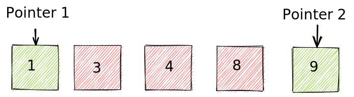
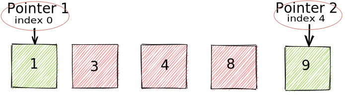

# Two Pointers and Searching Algorithms

## Recursion

before we get into the main points lets talk about `Recursion`

In the simple way `Recursion` is when a function calls itself until it doesn't.

let's see some examples:

```js
// display numbers from 1 to 10 using recursion

const fromNumtoTen = (number) => {

    if (number > 10) {
        return;
    }

    console.log(number);

    fromNumtoTen(number + 1);
}

fromNumtoTen(1);

```

```js
// get the factorial of a number 

const fact = (number) => {
    if (number === 1) {
        return 1;
    }

    return number * fact(number - 1);
}

console.log(fact(5)); // 120

```

to learn more about recursion you can see [this video](https://www.youtube.com/watch?v=k7-N8R0-KY4&t=746s)
or [this article](https://www.geeksforgeeks.org/recursion/)

## The Two Pointer Technique

The **two pointer technique** is a near necessity in any software developer's toolkit, especially when it comes to
technical interviews. In this guide, we'll cover the basics so that you know when and how to use this technique.



### What is the pattern?

The name `two pointers` does justice in this case, as it is exactly as it sounds. It's the use of two different
pointers (usually to keep track of array or string indices) to solve a problem involving said indices with the benefit
of saving time and space.



### When do we use it?

In many problems **involving collections such as arrays or lists**, we have to analyze each element of the collection
compared to its other elements.

There are many approaches to solving problems like these. For example we usually start from the first index and iterate
through the `data structure` one or more times depending on how we implement our code.

Sometimes we may even have to create an additional `data structure` depending on the problem's requirements. This
approach might give us the correct result, but it likely won't give us the most space and time efficient result.

This is why the `two-pointer technique` is efficient. We are able to process two elements per loop instead of just one.
Common patterns in the two-pointer approach entail:

- Two pointers, each starting from the beginning and the end until they both meet.

- One pointer moving at a slow pace, while the other pointer moves at twice the speed.

These patterns can be used for string or array questions. They can also be streamlined and made more efficient by
iterating through two parts of an object simultaneously. You can see this in
the [Reverse a String](https://leetcode.com/problems/reverse-string/)
, [middle of the linked list](https://leetcode.com/problems/middle-of-the-linked-list/)
and [valid palindrome](https://leetcode.com/problems/valid-palindrome) problems.

## Searching Algorithms

Searching Algorithms are designed to check for an element or retrieve an element from any data structure where it is
stored. Based on the type of search operation, these algorithms are generally classified into two categories:

- **Sequential Search**: In this, the list or array is traversed sequentially and every element is checked. For
  example: **Linear Search**


- **Interval Search**: These algorithms are specifically designed for searching in sorted data-structures. These type of
  searching algorithms are much more efficient than Linear Search as they repeatedly target the center of the search
  structure and divide the search space in half. For Example: **Binary Search**.

#### liner search implementation

```js
// time complexity O(n)
const search = (arr, element) => {
    for (let i = 0; i < arr.length; i++) {
        if (arr[i] === element) {
            return i;
        }
    }

    return -1;
}
```

#### binary search

Binary Search is a searching technique which works on
the [Divide and Conquer approach](https://www.geeksforgeeks.org/divide-and-conquer-algorithm-introduction/). It is used
to search for any element in a <ins>**sorted array**</ins>. Compared with linear, binary search is much faster with a
Time Complexity of `O(log n)`, whereas linear search works in `O(n)` time complexity.

##### binary search implementation

```js
const binarySearchIterative = (arr, element) => {
    // two pointers for the start and the end of an array
    let start = 0;
    let end = arr.length - 1;

    // iterate while start not meets end
    while (start <= end) {

        // find the middle index of an array
        let mid = Math.floor((start + end) / 2);

        // if the element is existing at the middle index return true
        if (arr[mid] === element) {
            return true;
            
        //  if the element you are looking for are on the right side  
        }else if(arr[mid] < element){
          start = mid + 1;
        
        //  if the element you are looking for are on the left side
        }else{
          end = mid - 1;
        }        
    }
    
    return false;
}
```

to read more about [searching algorithms](https://www.geeksforgeeks.org/searching-algorithms/)


## Exercises 

to practise more about the topics solve these problems

[Reverse a String](https://leetcode.com/problems/reverse-string/)

[Middle of the linked list](https://leetcode.com/problems/middle-of-the-linked-list/)

[Valid palindrome](https://leetcode.com/problems/valid-palindrome)

**also, you should implement the binary search algorithm using <ins>*Recursion approach*</ins>**

[binary search](https://leetcode.com/problems/binary-search/)
